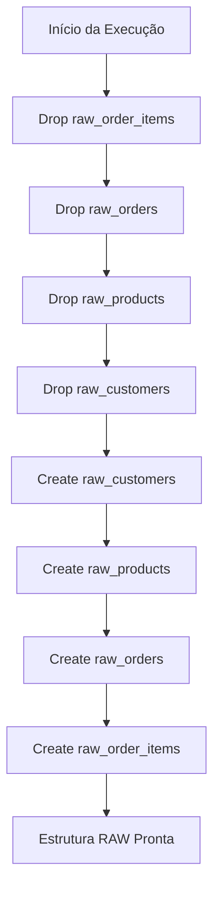

# deploy_raw_tables.sql

## Descrição Geral

Script DDL (Data Definition Language) responsável por criar a estrutura completa da **camada RAW** do data warehouse. Este script implementa o padrão de ingestão de dados brutos, onde todas as colunas são armazenadas como strings (VARCHAR/TEXT) para preservar os dados originais sem transformações, permitindo rastreabilidade e reprocessamento futuro.

O script segue uma abordagem idempotente, removendo tabelas existentes antes da criação para permitir re-execuções seguras.

---

## Tabelas Envolvidas

### Tabelas Criadas

1. `raw_customers` — Dados brutos de clientes
2. `raw_products` — Dados brutos de produtos
3. `raw_orders` — Dados brutos de pedidos
4. `raw_order_items` — Dados brutos de itens de pedidos

---

## Estrutura das Tabelas

### 1. `raw_customers`

Armazena informações brutas de clientes do sistema.

| Coluna | Tipo | Descrição |
|--------|------|-----------|
| `customer_id` | VARCHAR(50) | Identificador único do cliente (formato original) |
| `first_name` | VARCHAR(100) | Primeiro nome do cliente |
| `last_name` | VARCHAR(100) | Sobrenome do cliente |
| `email` | VARCHAR(255) | Endereço de e-mail |
| `registration_timestamp` | VARCHAR(255) | Data/hora de registro (formato string original) |
| `address_raw` | TEXT | Endereço completo sem estruturação |
| `load_timestamp` | TIMESTAMP | Data/hora de carga dos dados (gerado automaticamente) |

### 2. `raw_products`

Armazena informações brutas de produtos do catálogo.

| Coluna | Tipo | Descrição |
|--------|------|-----------|
| `product_id` | VARCHAR(50) | Identificador único do produto |
| `product_name` | VARCHAR(255) | Nome do produto |
| `category_raw` | VARCHAR(100) | Categoria do produto (formato original) |
| `price_string` | VARCHAR(50) | Preço em formato string (sem conversão numérica) |
| `stock_quantity_string` | VARCHAR(50) | Quantidade em estoque (formato string) |
| `load_timestamp` | TIMESTAMP | Data/hora de carga dos dados |

### 3. `raw_orders`

Armazena informações brutas de pedidos realizados.

| Coluna | Tipo | Descrição |
|--------|------|-----------|
| `order_id` | VARCHAR(50) | Identificador único do pedido |
| `customer_id` | VARCHAR(50) | Identificador do cliente (chave estrangeira lógica) |
| `order_date_string` | VARCHAR(50) | Data do pedido (formato string original) |
| `total_amount_string` | VARCHAR(50) | Valor total do pedido (formato string) |
| `status` | VARCHAR(50) | Status do pedido |
| `load_timestamp` | TIMESTAMP | Data/hora de carga dos dados |

### 4. `raw_order_items`

Armazena informações brutas dos itens individuais de cada pedido.

| Coluna | Tipo | Descrição |
|--------|------|-----------|
| `order_item_id` | VARCHAR(50) | Identificador único do item do pedido |
| `order_id` | VARCHAR(50) | Identificador do pedido (chave estrangeira lógica) |
| `product_id` | VARCHAR(50) | Identificador do produto (chave estrangeira lógica) |
| `quantity_string` | VARCHAR(50) | Quantidade do produto (formato string) |
| `unit_price_string` | VARCHAR(50) | Preço unitário (formato string) |
| `load_timestamp` | TIMESTAMP | Data/hora de carga dos dados |

---

## Joins e Relacionamentos

### Relacionamentos Lógicos (não implementados via FK)

```
raw_customers (1) ──────< (N) raw_orders
                              │
                              │
                              └──────< (N) raw_order_items >────── (N) raw_products
```

**Observação:** As tabelas RAW não possuem constraints de chave estrangeira implementadas, mantendo flexibilidade para ingestão de dados inconsistentes ou incompletos.

---

## Filtros e Condições

### Condições de Drop

```sql
DROP TABLE IF EXISTS [table_name]
```

- Utiliza `IF EXISTS` para evitar erros caso as tabelas não existam
- Ordem de drop respeita dependências lógicas (inversa à criação)

---

## Transformações

### Padrões de Design Aplicados

1. **Tipagem Flexível**: Todos os campos de dados de negócio são VARCHAR/TEXT
2. **Auditoria Automática**: Coluna `load_timestamp` com valor padrão `CURRENT_TIMESTAMP`
3. **Nomenclatura Descritiva**: Sufixos `_string` e `_raw` indicam dados não processados

### Campos com Default

- `load_timestamp TIMESTAMP DEFAULT CURRENT_TIMESTAMP` — Registra automaticamente o momento da inserção

---

## Parâmetros/Variáveis

**Nenhum parâmetro ou variável** é utilizado neste script. Trata-se de um script DDL estático.

---

## Fluxo de Dados



### Sequência de Execução

1. **Limpeza**: Remove tabelas existentes em ordem reversa de dependência
2. **Criação**: Cria tabelas na ordem de dependência lógica
3. **Resultado**: Camada RAW pronta para receber dados de fontes externas

---

## Observações

### ✅ Boas Práticas Implementadas

- **Idempotência**: Script pode ser executado múltiplas vezes sem erros
- **Auditoria**: Rastreamento temporal via `load_timestamp`
- **Preservação de Dados**: Formato original mantido para troubleshooting
- **Nomenclatura Clara**: Prefixo `raw_` identifica a camada de dados

### ⚠️ Considerações Importantes

1. **Sem Constraints**: Não há PKs, FKs ou checks implementados
2. **Sem Índices**: Performance de consulta não é otimizada nesta camada
3. **Dados Não Validados**: Aceita qualquer valor, incluindo nulos e duplicatas
4. **Tipagem Genérica**: Conversões de tipo devem ocorrer em camadas superiores (STAGING/TRUSTED)

### 🔧 Possíveis Otimizações

- Adicionar índices em colunas de join (`customer_id`, `order_id`, `product_id`) se consultas diretas forem frequentes
- Implementar particionamento por `load_timestamp` para grandes volumes
- Considerar compressão de colunas TEXT para economia de espaço
- Adicionar comentários nas tabelas/colunas usando `COMMENT ON`

### 📦 Dependências

- **Nenhuma dependência externa** — Script autossuficiente
- **Ordem de execução**: Deve ser o primeiro script da pipeline de dados
- **Camadas subsequentes**: STAGING → TRUSTED → ANALYTICS

### 🎯 Uso Recomendado

Este script deve ser executado:
- Na inicialização do ambiente de dados
- Após mudanças estruturais no modelo RAW
- Em ambientes de desenvolvimento/teste para reset de estrutura

---

**Versão da Documentação**: 1.0  
**Última Atualização**: 2024  
**Camada**: RAW (Bronze Layer)