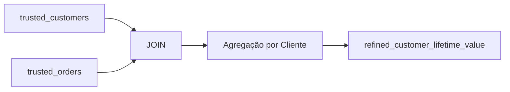

# refined_customer_lifetime_value.sql

## Descrição Geral

Este script SQL cria uma tabela analítica que consolida o **valor do tempo de vida do cliente** (Customer Lifetime Value - CLV). A query agrega dados de clientes e pedidos para fornecer uma visão consolidada do comportamento de compra e valor total gerado por cada cliente ao longo do tempo.

---

## Tabelas Envolvidas

| Tabela | Tipo | Descrição |
|--------|------|-----------|
| `refined_customer_lifetime_value` | Destino | Tabela criada para armazenar métricas de CLV |
| `trusted_customers` | Origem | Tabela confiável contendo dados de clientes |
| `trusted_orders` | Origem | Tabela confiável contendo dados de pedidos |

---

## Colunas

### Colunas de Origem

**Da tabela `trusted_customers` (alias `c`):**
- `customer_id` — Identificador único do cliente
- `first_name` — Primeiro nome do cliente
- `last_name` — Sobrenome do cliente
- `email` — Endereço de e-mail do cliente
- `load_timestamp` — Timestamp de carga dos dados do cliente

**Da tabela `trusted_orders` (alias `o`):**
- `order_id` — Identificador único do pedido
- `customer_id` — Chave estrangeira para o cliente
- `total_amount` — Valor total do pedido
- `order_date` — Data de realização do pedido
- `load_timestamp` — Timestamp de carga dos dados do pedido

### Colunas Calculadas (Destino)

| Coluna | Tipo | Descrição |
|--------|------|-----------|
| `customer_id` | Identificador | ID único do cliente |
| `first_name` | Texto | Primeiro nome do cliente |
| `last_name` | Texto | Sobrenome do cliente |
| `email` | Texto | E-mail do cliente |
| `total_spent` | Numérico (agregado) | Soma total gasta pelo cliente em todos os pedidos |
| `total_orders` | Inteiro (agregado) | Quantidade total de pedidos distintos realizados |
| `first_order_date` | Data (agregado) | Data do primeiro pedido do cliente |
| `last_order_date` | Data (agregado) | Data do pedido mais recente do cliente |
| `latest_customer_load_timestamp` | Timestamp | Timestamp mais recente de carga dos dados do cliente |
| `latest_order_load_timestamp` | Timestamp | Timestamp mais recente de carga dos dados de pedidos |

---

## Joins e Relacionamentos

### JOIN Principal

```sql
trusted_customers c
JOIN trusted_orders o ON c.customer_id = o.customer_id
```

- **Tipo:** INNER JOIN
- **Condição:** `c.customer_id = o.customer_id`
- **Relacionamento:** 1:N (Um cliente pode ter múltiplos pedidos)
- **Impacto:** Apenas clientes com pelo menos um pedido serão incluídos na tabela final

---

## Filtros e Condições

**Nenhum filtro WHERE ou HAVING aplicado.**

A query não possui cláusulas de filtro explícitas, portanto:
- Todos os clientes que possuem pedidos são incluídos
- Clientes sem pedidos são automaticamente excluídos devido ao INNER JOIN

---

## Transformações

### Funções de Agregação

| Função | Coluna | Propósito |
|--------|--------|-----------|
| `SUM()` | `o.total_amount` | Calcula o valor total gasto pelo cliente |
| `COUNT(DISTINCT)` | `o.order_id` | Conta o número único de pedidos |
| `MIN()` | `o.order_date` | Identifica a data do primeiro pedido |
| `MAX()` | `o.order_date` | Identifica a data do último pedido |
| `MAX()` | `c.load_timestamp` | Captura o timestamp mais recente de atualização do cliente |
| `MAX()` | `o.load_timestamp` | Captura o timestamp mais recente de atualização de pedidos |

### Agrupamento

```sql
GROUP BY c.customer_id, c.first_name, c.last_name, c.email
```

Os dados são agrupados por cliente, garantindo uma linha por cliente com todas as métricas agregadas.

---

## Parâmetros/Variáveis

**Nenhum parâmetro ou variável utilizado.**

Este script é estático e não aceita parâmetros de entrada.

---

## Fluxo de Dados



### Descrição do Fluxo

1. **Extração:** Dados são extraídos das tabelas `trusted_customers` e `trusted_orders`
2. **Relacionamento:** As tabelas são unidas através do `customer_id`
3. **Agregação:** Métricas são calculadas por cliente usando funções de agregação
4. **Criação:** Uma nova tabela `refined_customer_lifetime_value` é criada com os resultados consolidados

---

## Observações

### Pontos de Atenção

⚠️ **INNER JOIN:** Clientes sem pedidos não aparecerão na tabela final. Considere usar `LEFT JOIN` se for necessário incluir todos os clientes.

⚠️ **CREATE TABLE:** O script usa `CREATE TABLE`, o que falhará se a tabela já existir. Considere usar:
- `CREATE OR REPLACE TABLE` (dependendo do SGBD)
- `DROP TABLE IF EXISTS` antes do CREATE
- `CREATE TABLE IF NOT EXISTS`

### Possíveis Otimizações

1. **Índices:** Criar índices em `customer_id` nas tabelas de origem pode melhorar a performance do JOIN
2. **Particionamento:** Para grandes volumes, considere particionar por data ou faixas de valor
3. **Materialização:** Considere criar como VIEW materializada para atualização incremental

### Dependências

- **Upstream:** `trusted_customers`, `trusted_orders`
- **Downstream:** Tabelas ou relatórios que consomem `refined_customer_lifetime_value`

### Casos de Uso

- Análise de segmentação de clientes
- Identificação de clientes de alto valor (VIP)
- Análise de retenção e churn
- Cálculo de métricas de recência, frequência e valor monetário (RFM)
- Dashboards executivos de performance de vendas

---

**Camada de Dados:** Refined (Camada Analítica)  
**Tipo de Objeto:** Tabela Agregada  
**Frequência de Atualização Sugerida:** Diária ou conforme necessidade do negócio